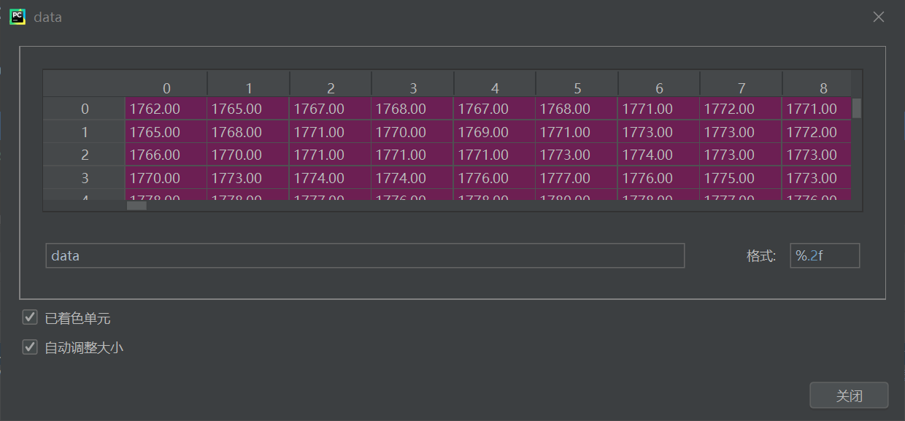
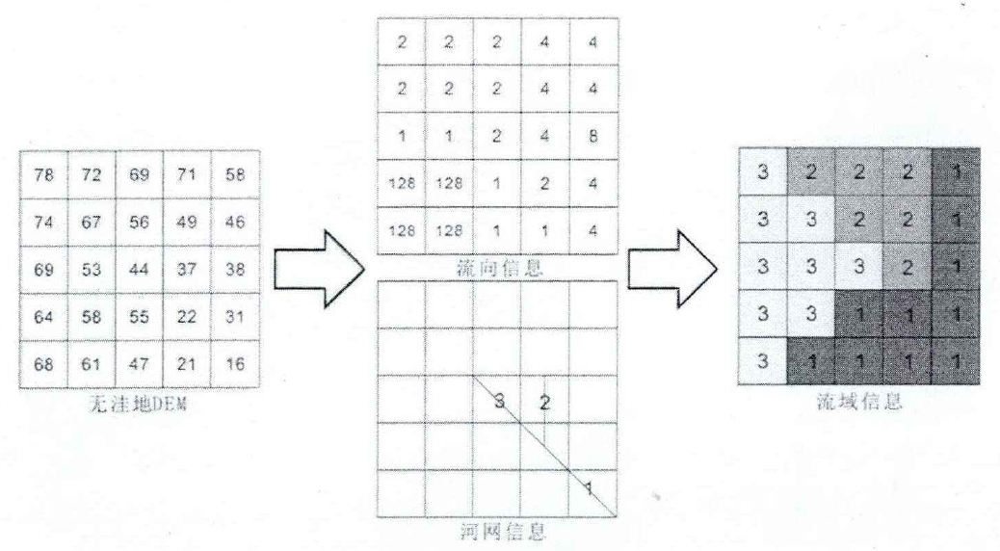
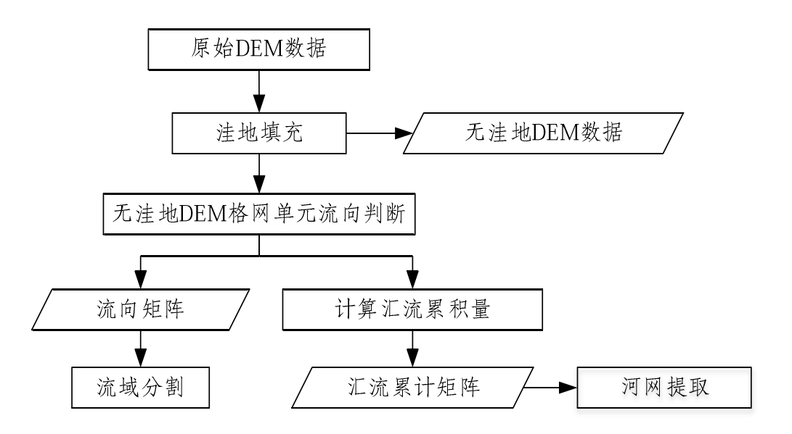
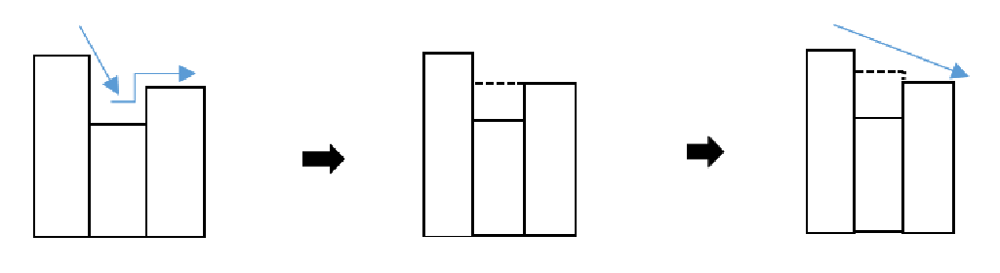
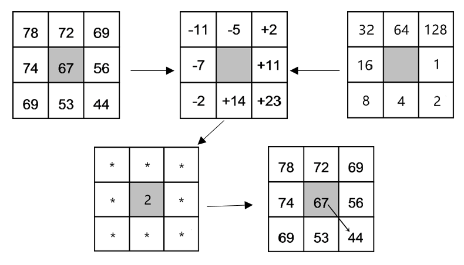
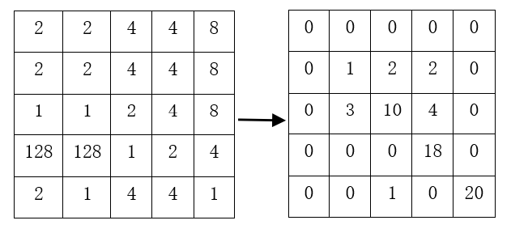

# 领域方向综合设计：基于地形分割及拓扑关系构建的可视化系统实现


## 〇、要求

对规则格网数据，进行基于流域或分割算法进行分割，构建各个分割块之前的拓扑关系，并显示；

对规则格网数据，采用VTK构建地形模型的三维显示系统，实现缩放、旋转等功能；

对规则格网地形数据，实现淹没分析算法，并实现缩放、旋转等功能；

对散点数据，采用狄洛尼算法构建地形表面，采用VTK构建地形模型的三维显示系统，实现缩放、旋转等功能。

## 一、基本概念

### 1. 规则格网模型

规则网格通常是正方形、矩形、三角形等规则网格。规则网格将区域空间切分为规则的格网单元，每一个格网单元对应一个数值。数学上可以表示为一个矩阵，在计算机实现中则是一个二维数组。每个格网单元或数组的一个元素对应一个高程值。

对于规则网格中每个格网的数值有两种不同的解释。第一种是格网栅格观点，认为该格网单元的数值是其中所有点的高程值，即格网单元对应的地面面积内高程是均一的高度，这种数字高程模型是一个不连续的函数。第二种是点栅格观点认为该网格单元的数值是网格中心点的高程或该网格单元的平均高程值，这样就需要用一种插值方法来计算每个点的高程。

规则格网的高程矩阵，用计算机处理很容易，并且可以计算等高线、坡度、坡向和自动提取流域地形等，使得它成为DEM 使用最广泛的格式，许多国家提供的DEM 数据都是以规则格网的数据矩阵形式提供的。格网DEM 的缺点是:一是在地形简单区存在大量冗余数据; 二是如不改变格网大小，无法适用于起伏复杂程度不同的地区;三是对于某些特种计算如通视计算，过分依赖格网轴线，四是不能准确表示地形的结构和细部。为避免这些问题，可采用附加地形特征数据，如地形特征点、山骨线、谷底线、断裂线等，以描述地形结构。

### 2. VTK

VTK，全称为Visualization Toolkit，也就是可视化工具包。是一个开源、跨平台、可自由获取、支持并行处理的图形应用函数库。通过VTK可以将科学实验数据如建筑学、气象学、医学、生物学或者航空航天学，对体、面、光源等等的逼真渲染，从而帮助人们理解那些采取错综复杂而又往往规模庞大的数字呈现形式的科学概念或结果。

Python作为一种动态编程语言，它的变量没有类型，traits 库可以为python添加类型定义，可以认为traits是tvtk对象的属性。颜色属性虽然可以接受多样的值，却不是能接受所有的值，比如"abc"、0.5等等就不能很好地表示颜色。而且虽然为了方便用户使用，对外的接口可以接受各种各样形式的值，但是在内部必须有一个统一的表达方式来简化程序的实现。用Trait属性可以很好地解决这样的问题：它可以接受能表示颜色的各种类型的值；当给它赋值为不能表达颜色的值时，它能够立即捕捉到错误，并且提供一个有用的错误报告，告诉用户它能够接受什么样的值；它提供一个内部的标准的颜色表达方式

### 3. 绘制技术

将长方体数据转化为三维图像，需要运用tvtk库的各种对象协调完成（管线）。具体包括：创建长方体对象tvtk.CubeSource；使用PloyDataMapper映射器，将数据转换为图形数据；创建一个Actor渲染器，将前者处理；创建一个Renderer，将Actor添加进去；创建一个RenderWindow(窗口)，将Renderer 添加进去；创建一个RenderWindowInteractor(窗口的交互工具)

TVTK库可读取的外部文件类型：.obj、.stl、.ply等。

读取stl文件的方法是：tvtk.STLReader(file_name = "文件名.stl")

读取MutiBlock数据的方法是：tvtk.MultiBlockPLOT3DReader(fname1,fname2,m,n)，fname1:Plot 3D 网格（XYZ文件），fname2:气动力学结果(Q文件)，m:标量数据数，n:矢量数据数

### 4. 管线技术

TVTK的管线包括两部分：可视化管线(Visualization Pipeline)：将原始数据加工成图形数据的过程。包括数据、数据预处理、数据映射。图形管线(Graphics Pipeline)：图形数据加工为我们所看到的图像的过程。包括数据映射、绘制、显示。

### 5. 数据集

ImageData： 正交等距网格 表示二维或三维图像的数据结构；在数组中存放数据，点位于正交且等距的网格上，我们不需要给出坐标，点之间的连接是隐性的；

RectilinearGrid：非等距正交网格 所有点都在正交但不等间距的网格上，由于是非等距的，所以需要规定点坐标；

StructuredGrid：任意形状的网格 可以创建任意形状的网格，需要指定点的坐标；

PolyData：点，点之间的联系和点构成的多边形 即前述创建三维对象实例所用的数据集。由一系列的点、点之间的联系以及由点构成的多边形组成。

UnstructuredGrid： 任意分布的点以及它们的区域面积

### 6. 可视化方法

在标量数据可视化实例中，创建等值面对象的方法是generate_values()和set_value()。generate_values()方法中的两个参数的意义为指定轮廓数和数据范围。set_value()的参数值会产生指定等值面和对应的等值面的值。

在矢量数据可视化中，为了表示矢量数据使用了TVTK库中Glyph3D(符号化技术)方法，MaskPoints()方法的作用是降采样。

在空间轮廓线实例中，计算PolyData对象的外边框使用了tvtk.StructuredGridOutlineFilter()方法

标量数据只有大小，而矢量数据有大小和方向。标量数据的表示只考虑大小，而矢量数据需要表示数据的大小与方向。标量数据的表示用等值面法，矢量数据的表示用箭头法或流线法。

Mayavi的mlab模块有6类函数：绘图函数、图形控制函数、图形修饰函数、相机控制函数、其他函数、Mlab管线控制。

快速绘图实例中对数据进行三维可视化的调用方法是mlab.mesh()

### 7. Mayavi

Mayavi管线的层级：最高层级为Engine：用于建立和销毁Scenes(场景)；第二层级为Scenes：每个场景下有多个数据集合Sources，为Mayavi可视化提供了数据；第三层级为Filters：应用于Scenes上对数据进行变换；第四层级为Module Manager：控制颜色表示标量或矢量数据，在pipline视图中表现为Colors and Legends；第五层级为Modules：最终数据的表示，如线条、平面等。

官方文档：http://docs.enthought.com/mayavi/mayavi/index.html

Mayavi.mlab中获取当前场景的方法是 mlab.gcf()；GridSource：网格对象的数据源，其界面中会显示每一项所对应的标量数据名称。它是是Scene 1的第一个子节点。；Surface：是Colors and legends的子节点，可设置一些显示对象的属性。

Point3d基于Numpy数组x、y、z提供的三维点坐标，绘制点图形，Plot3d（）基于1维Numpy数组x、y、z提供的三维坐标数据，绘制线图形。imshow(s, …)，s是一个二维数组,s的值使用colormap被映射为颜色。Surf()方法实例中是通过什么高程矩阵的方法获取x,y二维数组的。mlab中可以进行矢量数据可视化的方法有mlba.figure、mlab.surf等

选取红色小球实例的基本框架是：建立 一个 figure；随机生成红、白小球；初始化红色小球选取外框；鼠标选取任意红色小球，外框移动到该小球上（callback）；建立on_ mouse_pick()响应机制；1, 因为绘制选取框放在第一个小球上，而数组索引从0开始，所以下标为[0]。2，通过 if picker.actor in red_glyphs.actor.actors：语句，判断哪个小球被选取。再通过被选取的顶点ID除以单个小球顶点数目，计算小球的ID，从而获得小球坐标。3，所有对象都定义好了再进行绘制，从而解决初始化慢的问题

### 8. TraitsUI

Configure_traits调用了主界面窗口或模态对话框,界面显示后，进入消息循环；Edit_traits调用了无模态窗口或对话框（不是对画框）,界面显示后，不进入消息循环。

### 9. DEM

数字高程模型的简称，高程常常用来描述地形表面的起伏形态。它是用一组有序数值阵列形式表示地面高程的一种实体地面模型，是数字地形模型（DTM）的一个分支。现今基础地理信息生产部门提供的基础地理信息数据一般都是采用规则格网模型。在实际中使用的疏在计算机数据层面通常用地表规则网格单元构成的高程矩阵表示，以约定的格式以压缩或非压缩的方式存储在磁盘文件中，并形成了一定的标准。

规则格网 DEM 的数据在水平方向和垂直方向的间隔相等，格网点的平面坐标隐含在行列号中，故适宜用矩阵形式进行存储，即按行(或列)逐一记录每一个格网单元的高程值。同时为了实现行列号和平面位置坐标之间的转换，还需要记录格网西南角的坐标值、格网间距等。由于浮点型数据的字节数比整型数据的大，为了减少DEM 数据存储容量，常常将 DEM 每一个格网单元的数值减去 DEM 区域内的最低高程值，并乘上一个常数使之转换为整数，而在应用时再按上述反方向步骤进行恢复。规则格网 DEM 的数据文件一般包含用来进行 DEM 数据说明的数据头和 DEM 数据体两部分：

1. 数据头：定义 DEM 西南角起点坐标、坐标类型、格网间距、行列数、最低高程以及高程放大系数等内容；
2. 数据体：按行或列分布记录的高程数字阵列。

由于关系数据库对大数据量的 DEM 的访问要比文件系统经过更多的步骤，在同样的条件下，基于文件系统的数据库效率因此要高一些，但基于文件系统的数据库管理系统在事务处理、多用户访问、网络协议和安全机制等方面的能力是十分有限的。DEM 数据库由于其规则性比较强，一般采用文件系统和空间索引的方式进行管理。ESRI 公司提供的空间数据引擎(SDE)就采用了这一方案，通过 SDE 将 DEM 数据分解成多个表的形式存储于商用数据库(Oracle、SQL  Server 等)中，实现 DEM 数据在数据库中的读取与写入，同时提升了数据的组织管理水平。

“工程-工作区-图幅”的层次结构索引模式是当前 GIS 空间数据库数据组织常用的一种方法。

地形因子是为定量表达地貌形态特征而设定的具有一定意义的数学参数或指标。各种地貌，不论平原、谷地、高山，都是由不同的坡面组成的。

分水线包围的区域称为一条河流或水系的流域，流域分水线所包围的区域面积就是流域面积。也就是说，流域是指一条河流或水系的集水区域，河流从这个集水区域获得水量的补给。

## 二、架构设计

### 1. 环境配置

- PyCharm 2020.1 (Community Edition)

  ```markdown
  内部版本号 #PC-201.6668.115, 建立在 April 7, 2020
  JRE: 11.0.6+8-b765.25 amd64
  JVM: OpenJDK 64-Bit Server VM by JetBrains s.r.o
  Windows 10 10.0
  GC: ParNew, ConcurrentMarkSweep
  Memory: 970M
  Cores: 8
  Non-Bundled Plugins: com.intellij.zh
  ```

- python 3.6.8

  ```python
  apptools==4.4.0
  configobj==5.0.6
  mayavi==4.5.0+vtk71
  numpy==1.13.3+mkl
  pyface==5.1.0
  pygments==2.13.0
  PyQt4==4.11.4
  six==1.16.0
  traits==4.6.0
  traitsui==5.1.0
  VTK==7.1.1
  richdem~=0.3.4
  ```

### 2. 数据集：SRTM

SRTM（Shuttle Radar Topography Mission，航天飞机雷达地形测绘使命)是美国太空总署（NASA）和国防部国家测绘局（NIMA）以及德国与意大利航天机构共同合作完成联合测量，由美国发射的“奋进”号航天飞机上搭载SRTM系统完成。通过航天飞机的天线以及从航天飞机货舱伸出去的另一副雷达天线接收从地球表面各城市、田野、山脉、森林以及其他地形反射传回的雷达信号。两个雷达收到信号能够被合成为像三维立体电影或照片一样清晰逼真的地形图。

SRTM数据精度有1 arc-second和3 arc-seconds两种，称作SRTM1和SRTM3，或者称作30M和90M数据。目前能够免费获取中国境内的SRTM3文件，是90米精度的数据。每个90米的数据点是由 9个30米的数据点算术平均得来的。

SRTM3的数据组织方式为：每5度经纬度方格划分为一个文件，文件内包含6000x6000个采样点的高程数据。文件共分为24行（-60至60度）和72列（-180至180度）。文件命名规则为srtm_XX_YY.zip（或srtm_XX_YY.tiff），XX表示列数（01-72），YY表示行数（01-24）。


hgt格式数据：百度网盘链接:https://pan.baidu.com/s/13RdWA_SXR2BpX-0T7jpLRg 提取码:7jpf；http://www.viewfinderpanoramas.org/Coverage%20map%20viewfinderpanoramas_org3.htm

img格式数据：http://www.gscloud.cn/home

在本项目中使用hgt格式的数据进行实验。

HGT文件以16位有符号整数的二进制字节流存储，直接存储高程数据，没有文件头和压缩处理，每两个字节以空格分隔；文件大小固定2.75M，2,884,802 bytes ( = 1201 x 1201 x 2)，读取时，一次读取3个char，前两个char分别存储了高程数据16位Int的前8位和后8位，按Big Endian高位存储；

数据矩阵大小为1201*1201，无效值为：-32768。

经纬度范围由hgt文件名称确定，如N34W119.hgt，表示北纬34-35，西经118-119的高程数据，S26W050.hgt表示南纬25-26，西经49-50的高程数据，数字为从南到北的最小，从西到东的最小。

```python
# 数据读取
import os
import json
import numpy as np

SAMPLES = 1201  # Change this to 3601 for SRTM1
HGTDIR = 'hgt'  # All 'hgt' files will be kept here uncompressed

def get_elevation(lon, lat):
    hgt_file = get_file_name(lon, lat)
    if hgt_file:
        return read_elevation_from_file(hgt_file, lon, lat)
    # Treat it as data void as in SRTM documentation
    # if file is absent
    return -32768


def read_elevation_from_file(hgt_file, lon, lat):
    with open(hgt_file, 'rb') as hgt_data:
        # HGT is 16bit signed integer(i2) - big endian(>)
        elevations = np.fromfile(hgt_data, np.dtype('>i2'), SAMPLES*SAMPLES)\
                                .reshape((SAMPLES, SAMPLES))

        lat_row = int(round((lat - int(lat)) * (SAMPLES - 1), 0))
        lon_row = int(round((lon - int(lon)) * (SAMPLES - 1), 0))

        return elevations[SAMPLES - 1 - lat_row, lon_row].astype(int)

def get_file_name(lon, lat):
    """
    Returns filename such as N27E086.hgt, concatenated
    with HGTDIR where these 'hgt' files are kept
    """

    if lat >= 0:
        ns = 'N'
    elif lat < 0:
        ns = 'S'

    if lon >= 0:
        ew = 'E'
    elif lon < 0:
        ew = 'W'

    hgt_file = "%(ns)s%(lat)02d%(ew)s%(lon)03d.hgt" % {'lat': abs(lat), 'lon': abs(lon), 'ns': ns, 'ew': ew}
    hgt_file_path = os.path.join(HGTDIR, hgt_file)
    if os.path.isfile(hgt_file_path):
        return hgt_file_path
    else:
        return None

# Mt. Everest
print get_elevation(86.925278, 27.988056)
# Kanchanjunga
print get_elevation(88.146667, 27.7025)
```

```python
import matplotlib.pyplot as plt
import numpy as np

# 返回经纬网格及对应的海拔高度
def read_hgt(f_name, lat, lon):
    with open(f_name, 'rb') as hgt_data:
        elevations = np.fromfile(hgt_data, np.dtype('>i2'), SAMPLES * SAMPLES) \
            .reshape((SAMPLES, SAMPLES))
    lat_range = np.arange(lat, lat + 1 / 1200 + 1, 1 / 1200)
    lon_range = np.arange(lon, lon + 1 + 1 / 1200, 1 / 1200)
    return lat_range, lon_range, elevations

# 读取多个文件
def read_return(lat, lon):
    f_name = r'./I55/S{}E{}.hgt'.format(lat, lon)
    with open(f_name, 'rb') as hgt_data:
        elevations = np.fromfile(hgt_data, np.dtype('>i2'), SAMPLES * SAMPLES) \
            .reshape((SAMPLES, SAMPLES))
    lat_range = np.arange(-lat, -lat + 1 / 1200 + 1, 1 / 1200)[::-1] # 南半球纬度为负数
    lon_range = np.arange(lon, lon + 1 + 1 / 1200, 1 / 1200)
    return lat_range, lon_range, elevations

def plot_d(ax):
    for i in range(33, 41):
        for j in range(139, 153):
            if os.path.exists(r'./I55/S{}E{}.hgt'.format(i, j)):
                lat, lon, ele = read_return(i, j)
                lim = np.arange(1, 2401, 200)
                ax.contourf(lon, lat, ele, lim, cmap='binary')
            else:
                print(i, j)
    return ax


# 读取多个文件
if __name__ == '__main__':
	fig ,ax = plt.subplots()
	ax = plot_d(ax)
	plt.show()
```

通过 python 按照大端2字节的方式读入 *hgt* 格式的文件，得到一个*ndarray*格式的二维数组，大小为 $3601 \times 3601$，可以通过切片缩小二维数组的大小，减少处理的数据量。对于读入的 *N36W113.hgt* 数据，将其缩小为$1000 \times 1000$，最大值为2152，最小值为1188。



### 3. 算法：流域分割算法

<u>流域划分的本质是确定虚拟水系中每一条河流所对应的集水区域</u>。流域分析的方法有点分析（point-based analysis）和面分析（area-based analysis）两种，点分析即是提取给定特定点的上游汇水区，面分析是将整个分析区域按照沟谷段信息将流域分割成一个个子流域进行管理。划分的基本方法为：依据流向信息以及虚拟水系信息，通过遍历搜索确定每一个栅格点最终汇入的河流，并将河流的编码赋予当前栅格点以及在搜索路径中所遍历的栅格点。



流域分析最关键是 3 个基础矩阵的生成，分别为**无洼地矩阵、水流方向矩阵、累积矩阵**。因此流域分析的主要步骤包括：

1. DEM 预处理，主要包括洼地填充和平地抬高两个步骤，处理后形成具有明确流向的**无洼地矩阵**；
2. 流向分析，根据地球重力学原理，对无洼地 DEM 数据进行流向计算，给每一个格网赋予明确的流向，形成**水流方向矩阵**。
3. 汇流累积计算，以水流方向矩阵为基础进行汇流累积量的计算，得出**汇流累积矩阵**。
4. 河流网络的提取，通过对汇流累积矩阵的分析，根据阈值提取出河流网络。
5. 流域分割，根据河网沟谷段信息将整体流域分割成子流域的过程。



#### 3.1 DEM 预处理

在流域分析算法的步骤中，平地和洼地是中普遍存在的两种地形。平地是指中没有局部高程差的连通区域。洼地是指中的陷区域（高程低于周边区域）。洼地的形成有两方面的原因，一是因为在内插等处理中因人为失误而形成的“伪地形”，另一种则是真实存在的地形。由于多数情况下洼地和平坦区域被认为是伪地形，在河网提取之前需要将之去除，因此**处理洼地和平坦区域**一直被认为是流域提取中的关键步骤。通常首先对法地进行填平，在此基础上，对平地进行增高处理。通用的流域分析算法主要以 *Olivier Planchon* 和 *Frédéric Darboux* 的 *M&V* 算法（*Planchon O, Darboux F. A fast, simple and versatile algorithm to fill the depressions of digital elevation models[J]. Catena, 2002, 46(2):159-176.*）为例。

该算法的算法原理为使用坡面漫流法覆盖整个 DEM，再剔除多余的水。具体步骤为：

1. 首先遍历原始 DEM 数据所有栅格单元，使用一个**极大的临时水面高程**将替换原始格网点高程；
2. 接着在原始 DEM 数据中找出**高程最小值点**，若八邻域格网点的高程均不低于该格网点高程，则标记为**洼地点**并记录在容器中；
3. 利用迭代法将覆盖过的 DEM 数据上多余的水逐一去除，找出 8 邻域中高程相对较低的点，即为该洼地的潜在**出水口**，把该出水口的高程值赋给中心各网点；
4. 所有步骤进行完之后便可得到无洼地 DEM 数据。



#### 3.2 流向计算

流向算法按照下游流向格网个数，可以分为单流向算法 *SFD* 、多流向算法 *MFD* 以及混合流向算法。

单流向算法的基本思想是，假设每个栅格单元的水流只从**一个方向**流出，自然条件下水向低处流，通过判断栅格之间的高差，假设所有水流全部流向高差最大的栅格方向，单流向方法中最常用、最受欢迎的方法是 *D8* 算法，另外还有其改进算法，如：*Rhos* 算法、*Lea* 算法、*DEMON* 算法等。单流向算法的算法结构简单，比较适用于模拟比较简单的沟谷汇流，在河网提取中有较好的效果，是各大软件应用的主要算法，如 ArcGIS、GRASS 等。但单流向算法无法很好地模拟坡面漫流，由于其水流流向单一也容易形成平行流现象。

*D8* 算法最早是由 *Callahgna* 等（*O'Callaghan  J  F,  Mark  D  M.  The  extraction  of  drainage  networks  from  digital  elevation  data[J]. Computer Vision Graphics & Image Processing, 1984, 28(3):323-344.*）提出的，其基本原理是最陡坡度降法，它假设每个栅格单元的水流的方向只有其周围 8 个格网可选，使用$$3\times3$$ 的栅格窗口对 DEM 格网数据进行遍历，计算中心格网单元与其邻域 8 格网间的**距离权落差**，距离权落差值最大的格网单元的方向即为中心格网流向。该方法计算量小，实用性强，是目前使用最广的流向计算法。

*Rho8*尝试解决 *D8* 算法中对水流方向的限制。该算法是根据格网单元所在表面的**坡向**来确定流向，虽然确定的流向由随机性的特点，但是也产生了新的问题，由于其所产生结果的随机性，使其不一定可以进行进一步的河网提取等过程，而且产生的错误流向在接下来的流域分析当中，更加会引起一系列不可预测错误。因此 Lea 对该算法进行了改进。

*Lea* 算法确定水流路线主要通过计算**局部坡向角**，*Lea* 将水流是一种球体，它可以沿着最陡坡降方向并且经过每个地形表面滚动，同时每个中心栅格表面都可以作为最适合该最陡坡降方向的格网高程的平面，该平面的坡向即可确定水流方向，根据坡向角，水流即可沿着由不同方向直线片段所构成的路径流出。虽然解决了水流路径不确定性的问题，但是使用一维的点源和线段来表达二维的水流及其路径，依然是需要考虑的问题。 

*DEMON*（*Digital Elevation Model Networks*）算法（ *Costa-Cabral M C, Burges S J. Digital Elevation Model Networks (DEMON): A model of flow over hillslopes  for  computation  of  contributing  and  dispersal  areas[J].  Water  Resources  Research,  1994, 30(6):1681-1692.*）是 *Costa-Cabral * 于 1994 提出的。他认为水流是二维的且并非从水流中心开始，而是起始于某个格网单元表面，水流是均一的，其宽度也是可变的，该算法中采用**高程张量**来代表流向，并由此获取水流路径的宽度。然而，众所周知三点确定一个平面，而使用该方法仍然需要选择适合的平面，该平面的选择必须考虑到$$3\times3$$ 窗口的四个角点，但是这四个角点的高程值却未必能满足同时处于这个适合的平面上，也会由此导致错误的流向，会给流域分析带来困难，依然难以推广。

<u>水流方向是指水流离开格网时的流动方向。</u>以无洼地 DEM 数据为基础，通常使用 $$3\times3$$ 窗口对整个要分析的格网区域进行扫描，使用 *D8* 算法确定水流方向。在 $$3\times3$$ 局部窗口中，设置中心格网为 $$ c $$，其流向在八邻域中选择，且水流全部流向拥有**最大权落差**的方向，邻域格网点编号用$i(i = 1,2, … ,8)$表示，$i$​ 满足条件
$$
max\{k \times (z_c-z_i)\}; \quad i = 1, 2, ..., 8
$$
当 $i$ 位于南北方向时，$k = 1$；当 $i$ 为对角线方向时，$k = \sqrt{2}$；由此可看出使用 *D8* 算法所得出的流向是相差为 45 度的八个方向之一，在程序中 $D8$ 算法使用1, 2, 4, 8, 16, 32, 64, 128 八个**特征码**来标记中心格网水流可能流向的八个方向，标记方式是从**正东方向**开始**顺时针**标注。流向判别方法主要分为两步:

1. 处理**非平地点**的流向，对于非平地点规定其流向为八邻域高程最小值点，若该非平地点为边界点且其 8 邻域点都比中心点高程值高时，则流向边界外面。同时对于同一块平地上的栅格点，先对平地点进行标识，然后对不同标识的平地点进行逐一处理。
2. 处理**平地点**（平地点是在局部区域内各方向上都没有凹凸性变化的点）流向，首先找出其边界上的**最小值点**作为该平地的出水口，并将出水口存入容器中，接着进行如下操作：
   1. 遍历存储在容器中的出水口，若以该点为中心的八邻域中存在平地点，则流向中心点。
   2. 若一个平地点可以流向容器中的多个点，则以横流或竖流优先的原则处理，即只要可以上下左右流，就不斜着流。
   3. 循环上述方法，直到容器为空。
3. 最终判断出格网所有点的流向，得到水流方向矩阵。



#### 3.3 汇流累积

<u>计算某一格网的水流累积量是指计算流向该格网的**上游格网单元**的**总汇水量**</u>，在此可以将上游格网单元认为是等权的，因此上游汇水量可以用**上游格网个数**或者**总面积**来表示。汇流累积量的大小实质上是代表某栅格点上游有多少个栅格的水流最终流经这个栅格，它是流域划分的基础。

进行汇流累积计算时假设每个初始栅格各携带一份水流，标志为 1；使用递归的方法分别对每个栅格八邻域进行分析，对于某栅格点的汇流累积量 $M$​，每增加一个流向指向该栅格，其汇流累积量加 1，若径流上游格网的汇流累积量为 $𝑀_i (i =1, 2, … , 8)$​，公式表达为：
$$
M = \sum{M_i + i}
$$


#### 3.4 流域分割

<u>流域分割是指将一个流域划分成子流域的过程。</u>通常流域分割都是在河网分级之后进行的，当汇流累积量达到一定数值的时候，水流呈周期性流动形成槽形沟谷段，各个沟谷段汇聚成河流网络，流域分割的过程就是确定每个沟谷段的流域范围，将流向某沟谷段的上游格网单元识别出来，划分到一个子流域中。具体算法为：

1. 首先从流域的出口开始，按照**左侧优先**的顺序进行沟谷段追踪，出水口标志为 1，遇到未编号节点则加 1，并将沟谷段入栈；
2. 然后根据河网分级的唯一编号和沟谷段的唯一编码，从栈中取出某沟谷段的格网单元，若其 8 邻域未进行分割且流向指向中心格网，则将其邻域格网单元赋相同标识并入栈；
3. 重复以上步骤直至栈为空，最终完成流域分割。

### 4. 系统设计

支持的功能：DEM数据的读入与保存，流域分割算法实现分割，获取分割块之间的拓扑关系并展示相关信息。

- 数据读取模块
  - 文件读取
  - 数据库设计
- 算法实现模块
- 数据展示模块
- 交互模块


## 未来的工作

- [x] 获取数据集
- [x] 选取合适的算法
- [ ] 实现算法
- [ ] 扩大数据规模
- [ ] 数据库设计
- [ ] 数据库搭建
- [ ] 界面设计
- [ ] 数据展示
- [ ] 交互设计

## 参考文献

Priority-Flood: An Optimal Depression-Filling and Watershed-Labeling Algorithm for Digital Elevation Models https://github.com/r-barnes/Barnes2013-Depressions

RichDEM https://github.com/r-barnes/richdem https://richdem.com/

TraitsUI https://docs.enthought.com/traitsui/

Python科学计算三维可视化 https://www.icourse163.org/course/BIT-1001871001
